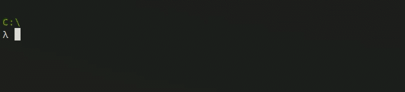

# About

**_Master Student_** - PRC State Key Laboratory of MEAC

I’m interested in 
  - Reverse engineering
  - Network protocols
  - Malware analysis 

## Publications

+ **Protocol Reverse-Engineering Methods and Tools: A Survey.** _Yuyao Huang_, Hui Shu, Fei Kang, Yan Guang. Computer Communications. 2022. **(Accepted)**

+ **A Software Upgrade Security Analysis Method Based on Program Analysis.** Xiaoshao Lv, Hui Shu, Fei Kang, _Yuyao Huang_. The 2021 IEEE International Conference on Computer Science, Electronic Information Engineering and Intelligent Control Technology, CEI 2021, Fuzhou, China, Sept. 24-26, 2021. **(Accepted)**

+ **Automated Analysis Method of Cipher Mechanisms in Software Based on Data Flow.** _Yuyao Huang_, Yan Guang, Ju Yang, and Fei Kang. Journal of Information Engineering University, 2021, 22(2): 191-199. DOI: [10.3969/j.issn.1671-0673.2021.02.011](http://dx.doi.org/10.3969/j.issn.1671-0673.2021.02.011)

+ **Generating Malicious Code Attack Graph Using Semantic Analysis.** Ping Yang, Hui Shu, Fei Kang, Wenjuan Bu, _Yuyao Huang_. Computer Science, 2021, 48(6A): 448-458. DOI: [10.11896/jsjkx.201100074](http://dx.doi.org/10.11896/jsjkx.201100074)

## Awards

+ **National Cyber Security Scholarship**, 2019, CIDF

+ 🥇**First Prize** of National College Student Information Security Contest, 2018, CISCN

+ 🥈**Second Prize** of ASC Student Supercomputer Challenge, 2018, ASC & Inspur Group

+ 🥉Bronze Medal of ACM-ICPC China Invitational Contest (Xi'an Site), 2018, ICPC

+ 🥉Bronze Medal of ACM-ICPC Asia Regional Contest (Xi'an Site), 2017, ICPC

## Contacts

- 📫 [Hwang](mailto:yyhuang_ieu@163.com)
- 🏠 [Homepage](https://rruzi.github.io/)

<!---
RrUZi/RrUZi is a ✨ special ✨ repository because its `README.md` (this file) appears on your GitHub profile.
You can click the Preview link to take a look at your changes.
--->
